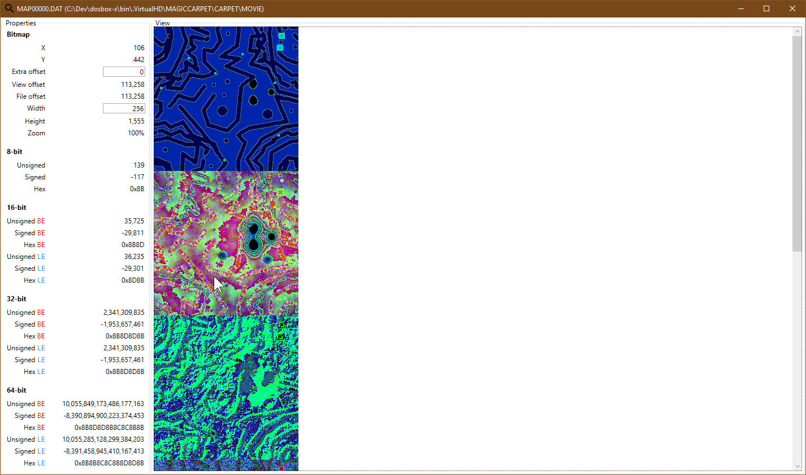
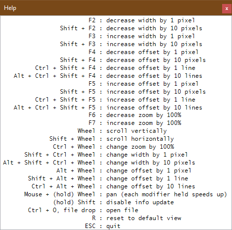

# RAWInspector
A tool for visually inspecting binary files

(highly inspired from GfxRip and Maptapper)

This is a tool I've developed when I tried to reverse-engineer some games' file formats.

It allows to get a quick overview of what's in a file and play with the stride and offset:

There's a strong emphasis on keyboard use, here's the help:

(tip: when panning with the mouse, wrapping is active for a more pleasent experience)

## Links

http://retrospec.sgn.net/game/gfxrip

http://b3dgs.com/gfxrip/

http://codetapper.com/amiga/maptapper/
